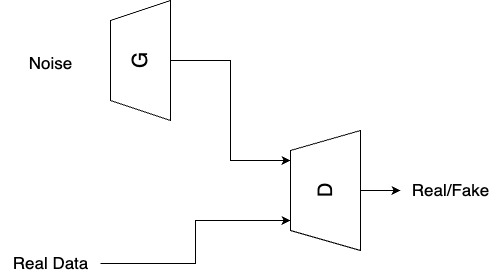
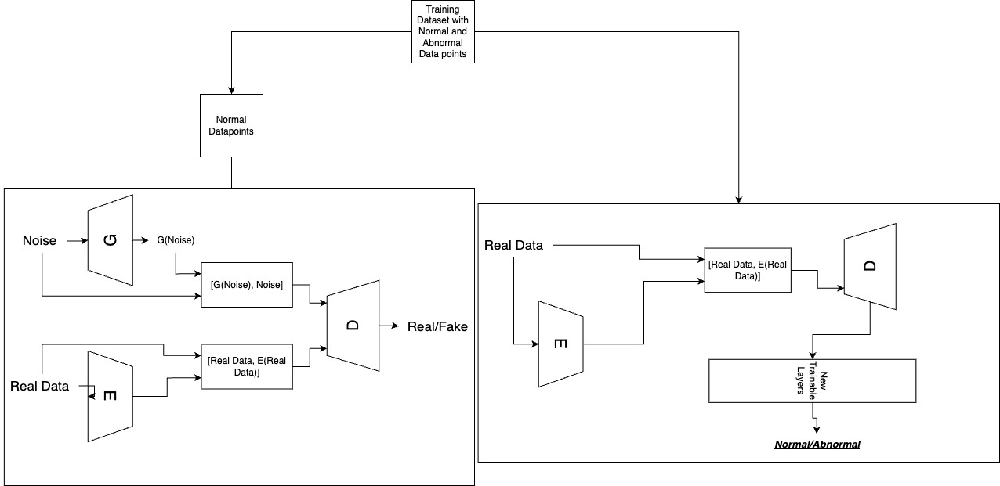
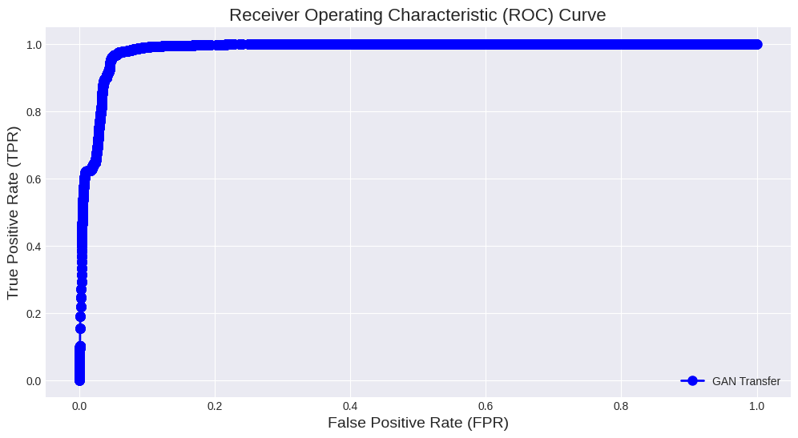
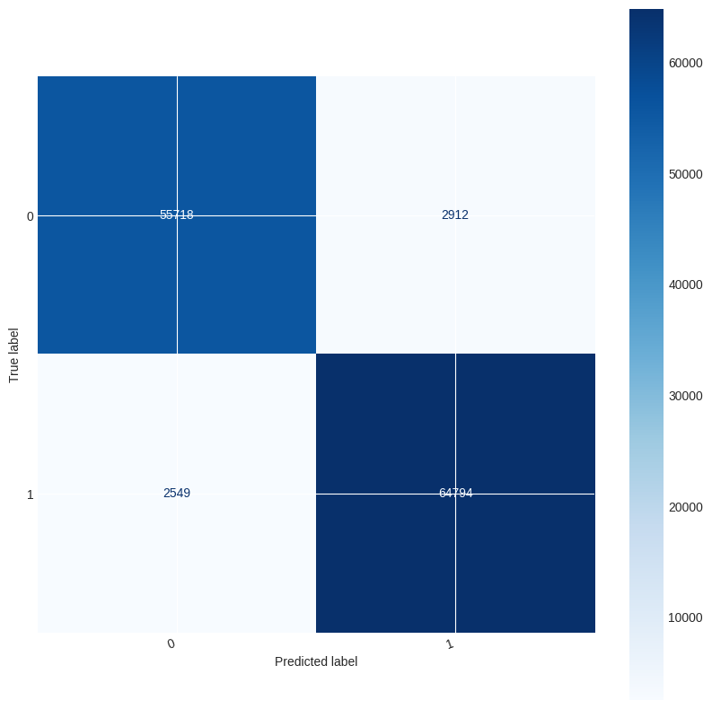

# Deep Learning Intrusion Detection System

## Abstract

We propose a novel approach for network intrusion detection using Bidirectional GANs (Bi-GANs), which leverage transfer learning from the discriminator to the generator. This enables the generator to produce realistic synthetic samples that match the features of intrusion data, which are different from image data in terms of structure, dimensionality, and size. Our method trains the generator and the discriminator separately until a certain loss criterion is met, improving the efficiency and performance of both components. We also introduce a one-class classifier based on the encoder–discriminator pair, which simplifies the intrusion detection process by avoiding the use of anomaly scores or thresholds.

## Code Overview

### Data Preprocessing
- **Data_Preprocessing_NSL_KDD.ipynb**: Exploratory Data Analysis (EDA) for NSL-KDD dataset.

### Model Development
- **Advancing_Network_Intrusion_Detection.ipynb**: EDA with Multi-layer Perceptron (MLP) model, LSTM model, and a Simple Bi-GAN Model.

### Transfer Learning
- **Advancing_Network_Intrusion_Detection_Transfer_Learning.ipynb**: Bi-GAN model with Transfer Learning using a classifier.

### Two-Generator Model
- **Advancing_Network_Intrusion_Detection_two_Gen_Model.ipynb**: Bi-GAN Model with training involving two generators.

All notebooks include performance evaluation metrics.

## How to Use

1. Open the respective Jupyter notebooks using an environment that supports deep learning libraries.
2. Execute the cells sequentially to run the code and reproduce the results.
3. Explore the EDA, model development, and transfer learning sections for a comprehensive understanding.
4. Evaluate the performance of the intrusion detection system using the provided metrics.

## Requirements

Ensure you have the necessary libraries installed. You can install them using the following:

## Dependencies

- Python 3.x
- PyTorch
- NumPy
- Pandas
- Matplotlib
- Seaborn
- tqdm
- scikit-learn

## GAN

# Training

# Results

